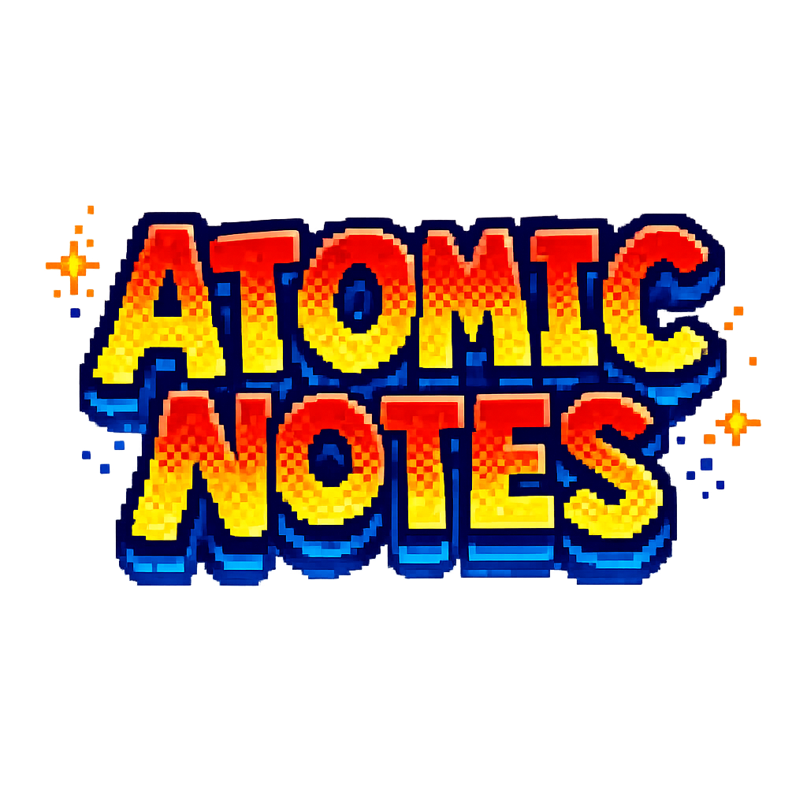

<div align="center">
  

  <h3>Generate comprehensive Obsidian knowledge bases with a coordinated AI agent swarm.</h3>

  [](LICENSE)
  [](https://obsidian.md)
  [](#)
</div>

---

Atomic Notes is a complete note-generation methodology for your coding agents. Give it a topic, and it orchestrates a 5-phase AI swarm that researches, writes, audits, and indexes a fully linked Obsidian vault — no shallow summaries, no placeholder text.

## Quickstart

Give your agent the Atomic Notes skill: [Antigravity](#antigravity), [Claude Code](#claude-code).

Then just ask:

> *"Make notes on Quantum Computing into my vault at `/path/to/vault`"*

That's it. The swarm takes over from there.

## How It Works

It starts the moment you give it a topic. Instead of immediately generating notes, it first builds a structured syllabus — mapping your topic into MOC (Map of Content) buckets, subtopics, and strictly defined atomic concepts. It shows you the plan and waits for your approval.

Once you sign off, it launches parallel research agents that perform *real* web searches, extracting facts, sources, and definitions. Every research output passes through validation gates that reject hollow or fabricated content.

Next, writer agents transform the raw research into beautifully formatted Obsidian notes with proper frontmatter, wikilinks, and Dataview fields. If a note already exists, it merges updates without overwriting your custom prose.

Before finishing, a link-critic agent audits the entire knowledge graph — fixing broken wikilinks, connecting orphans, and flagging quality issues. Finally, an indexer compiles the master index, per-bucket MOCs, and a glossary.

The result is a fully navigable, deeply interconnected Obsidian vault that you can open and start using immediately.

## The 5-Phase Pipeline

| Phase | Agent | What It Does |
|-------|-------|-------------|
| 1 | **Mapper** | Outlines the topic into 3 MOC buckets, 6–10 subtopics, and ~24 atomic concepts. Scans existing vaults for incremental updates. |
| 2 | **Researchers** | Dispatched in parallel. Performs real web searches. Extracts facts, sources, and definitions. Validated by strict quality gates. |
| 3 | **Writers** | Transforms research into formatted Obsidian notes. Merges into existing notes without overwriting. Enforces 150+ word minimum. |
| 4 | **Link-Critic** | Audits the internal link graph using Python scripts. Fixes broken wikilinks, connects orphans, flags poor content. |
| 5 | **Indexer** | Compiles the Master Index, per-bucket MOCs, and a definitive Glossary. |

## Installation

Installation differs by harness. If you use more than one, install Atomic Notes separately for each.

### Antigravity

Install as a skill from this repository:

```bash
agy skill install https://github.com/Alinoorbhatti/Atomic-notes
```

The skill triggers automatically when you ask your agent to make notes on a topic.

### Claude Code

Copy the `skills/` directory into your project's `.claude/skills/` folder, or symlink it:

```bash
cp -r skills/ .claude/skills/atomic-notes/
```

Then ask Claude to use the `notes-coordinator` skill.

## MCP Server

Atomic Notes ships with a [Model Context Protocol](https://modelcontextprotocol.io/) server that exposes the vault auditing scripts as typed tools for your AI agents:

- **`scan_vault`** — Inventory an existing vault's notes and structure
- **`validate_links`** — Check for broken wikilinks and orphaned notes
- **`parse_frontmatter`** — Extract and validate YAML frontmatter from notes

To start the server:

```bash
cd scripts
pip install -r requirements.txt
mcp run mcp_server.py
```

This lets agents interface with your vault programmatically instead of guessing at its contents.

## Project Structure

```
├── skills/                  # The 6 agent skills that form the swarm
│   ├── notes-coordinator/   # Master orchestrator — runs the pipeline
│   ├── notes-mapper/        # Phase 1: Topic → structured syllabus
│   ├── notes-researcher/    # Phase 2: Web research per concept
│   ├── notes-writer/        # Phase 3: Research → Obsidian notes
│   ├── notes-auditor/       # Phase 4: Link graph validation
│   └── notes-indexer/       # Phase 5: MOCs, index, glossary
├── scripts/                 # Python auditing tools + MCP server
├── evals/                   # Pipeline test suite
└── assets/                  # Logo and media
```

## Core Philosophy

- **Substance over structure.** A beautifully formatted note with placeholder text is worthless. Validation gates strictly reject hollow outputs.
- **Strict atomicity.** One concept per file. No mega-notes.
- **Link integrity.** No dead ends. The knowledge graph is audited before completion.
- **Incremental by default.** Re-running on an existing vault expands it — it doesn't nuke your work.

## License

[MIT](LICENSE) — Alinoor Bhatti
