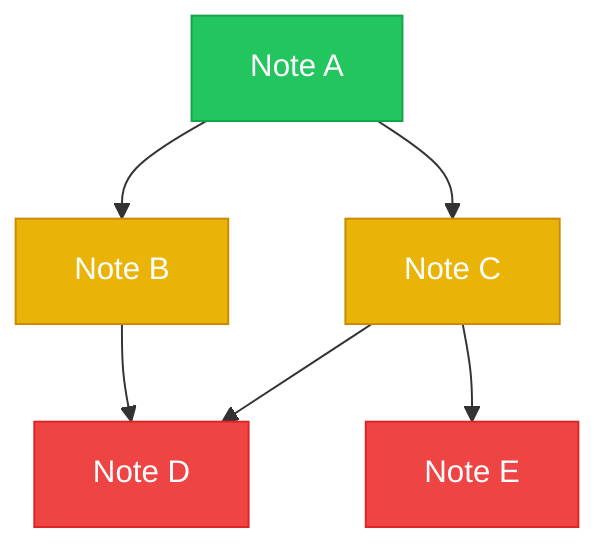

# Road Mapper (v1)

Generate an **optimal learning roadmap** for an Obsidian vault by analyzing
the wikilink dependency graph and producing a color-coded Mermaid flowchart
that shows which notes to read in what order.

The core insight: in any knowledge base, some concepts are prerequisites
for others. "Qubit" must be understood before "Quantum Entanglement," which
must be understood before "Shor's Algorithm." This skill discovers those
dependency chains automatically from the link graph and produces a visual
reading path.

---

## Step 0 — Gather Input

If not provided in the invocation, ask:
1. **Vault path** — absolute path to the Obsidian vault root or topic directory
2. **Topic name** (optional) — if the vault contains multiple topics, which one
   to map. If omitted, map the entire vault.

Confirm before proceeding.

---

## Step 1 — Scan the Vault

Read every `.md` file under the vault path (excluding hidden dirs like
`.research/`, `.obsidian/`). For each file, extract:

- **Title**: from `title:` frontmatter or `# Heading 1`
- **Slug**: the filename without `.md`
- **Bucket/Category**: from `bucket:` frontmatter, or parent directory name
- **Tags**: from `tags:` frontmatter
- **Outgoing wikilinks**: every `[[Target]]` or `[[Target|alias]]` in the body
- **Connections list**: from `connections:` frontmatter array
- **Word count**: approximate body length (excluding frontmatter)
- **File type**: determine if it's an atomic note, MOC, index, glossary, or stub
  (based on tags, directory, or frontmatter clues)

Build a **note registry**: `Map<slug, NoteMetadata>`.

Skip MOCs, Index, Glossary, stubs, and audit files — only map atomic
content notes for the roadmap.

---

## Step 2 — Build the Dependency Graph

For each atomic note, determine its **prerequisites** (what you should
read before it) and **dependents** (what you can read after it).

### Heuristic for prerequisite detection:

A note `B` is a prerequisite of note `A` if:
1. `A` links to `B` in its Connections section, AND
2. `B` is in a "more foundational" bucket than `A`, OR
3. `B` has more incoming links than `A` (it's more central/general), OR
4. `B` appears in `A`'s Overview section as context-setting

### Graph construction:

```
For each note A:
  For each outgoing wikilink target T in A's Connections:
    If T is an atomic note (not MOC/Index/Glossary):
      Determine direction:
        - If T.bucket is more foundational than A.bucket → T is prerequisite of A
        - If T has more incoming links than A → T is prerequisite of A
        - If A.bucket is more foundational than T.bucket → A is prerequisite of T
        - If equal → use in-degree as tiebreaker (higher in-degree = more foundational)
      Add directed edge: prerequisite → dependent
```

**Bucket ordering** (default, adapt to the vault):
- Foundations / History / Theory → most foundational (tier 1)
- Mechanisms / Processes / Structure → middle (tier 2)
- Applications / Implications / Practice → most advanced (tier 3)

If bucket names don't match these patterns, use **in-degree** as the
primary signal: notes with more incoming links are more foundational.

### Cycle detection:

If the dependency graph has cycles (A requires B requires A), break
them by removing the edge with the weaker signal (e.g., if both are
in the same bucket, remove the edge from the lower-in-degree note).

---

## Step 3 — Assign Difficulty Tiers

Using the dependency graph, assign each note a **tier** based on its
longest path from any root (a note with zero prerequisites):

- **🟢 Beginner** (Tier 1): Root notes — zero prerequisites. Start here.
- **🟡 Intermediate** (Tier 2): Longest prerequisite chain = 1-2 steps.
- **🔴 Advanced** (Tier 3): Longest prerequisite chain = 3+ steps.

Also compute a **suggested reading order** using topological sort.
When multiple notes are at the same tier/depth, sort by:
1. Bucket order (foundations first)
2. In-degree (more-referenced notes first)
3. Alphabetical (tiebreaker)

---

## Step 4 — Generate the Roadmap

Write a `_Roadmap.md` file to the vault with three sections:

### 4a. Reading Order Table

A numbered list showing the optimal sequence:

```markdown
## Reading Order

| # | Note | Tier | Bucket | Prerequisites |
|---|---|---|---|---|
| 1 | [[Foundations Note A]] | 🟢 Beginner | Foundations | — |
| 2 | [[Foundations Note B]] | 🟢 Beginner | Foundations | — |
| 3 | [[Mechanisms Note C]] | 🟡 Intermediate | Mechanisms | A, B |
| 4 | [[Mechanisms Note D]] | 🟡 Intermediate | Mechanisms | B |
| 5 | [[Applications Note E]] | 🔴 Advanced | Applications | C, D |
```

### 4b. Mermaid Flowchart (Dependency Graph)

A color-coded directed acyclic graph showing real prerequisite
relationships. Mermaid lays out branching and merging naturally —
do NOT force a grid or linear chain.

**Template:**

````markdown
## Visual Roadmap


````

**Rules for the Mermaid chart:**
- Use `flowchart TD` (top-down). Let Mermaid's layout engine handle positioning.
- Each edge represents a real "read X before Y" prerequisite from the DAG.
- Do NOT force a linear chain or grid layout. Let the graph branch and merge naturally.
- Node labels are just the note title (quoted). No step numbers — the table has those.
- Color code nodes by tier: 🟢 beginner, 🟡 intermediate, 🔴 advanced, 🟣 milestone/gateway.

### 4c. Learning Path Narrative

A short prose section (3-5 paragraphs) explaining the recommended
reading strategy:

```markdown
## How to Use This Roadmap

Start with the **🟢 Beginner** tier. These are the foundational concepts
that everything else builds on. Read them in the order listed — each one
introduces ideas that the next note assumes you know.

Once you've covered the basics, move to the **🟡 Intermediate** tier.
Here you'll encounter the mechanisms and processes that connect the
foundational ideas. The prerequisites column tells you exactly which
beginner notes to review if something feels unfamiliar.

Finally, the **🔴 Advanced** tier covers applications, implications, and
cutting-edge developments. These notes synthesize multiple concepts from
the earlier tiers.

**Gateway concepts** (marked with 🟣 in the chart) are especially
important — they unlock the largest number of downstream notes. If you're
short on time, prioritize these.
```

---

## Step 5 — Write the File

Write the complete `_Roadmap.md` to:
`<vault_path>/<topic-slug>/_Roadmap.md` (if topic-slug exists)
or `<vault_path>/_Roadmap.md` (if mapping the whole vault)

Use this frontmatter:

```yaml
---
title: <Topic> — Learning Roadmap
topic: <Topic>
tags: [<topic-slug>, roadmap, learning-path]
type: roadmap
created: <YYYY-MM-DD>
total_notes: <N>
tiers:
  beginner: <count>
  intermediate: <count>
  advanced: <count>
gateway_concepts: [<list of gateway note titles>]
---
```

---

## Step 6 — Report to User

```
Road Mapper complete for: <Topic>

📊 Analyzed <N> atomic notes across <M> buckets
🟢 Beginner:     <B> notes (start here)
🟡 Intermediate: <I> notes
🔴 Advanced:     <A> notes
🟣 Gateway concepts: <list of 2-3 most important gateway notes>

Roadmap: <path to _Roadmap.md>

Open the roadmap in Obsidian to see the interactive flowchart.
The Mermaid diagram renders natively — click any node's [[wikilink]]
to jump to that note.
```

---

## Key Rules

**Prerequisites are inferred, not declared.** The skill uses the link
graph structure + bucket ordering to determine what should be read first.
This means it works on any vault with wikilinks, not just structured ones.

**Gateway concepts matter most.** A "gateway" is a note with high
out-degree in the dependency graph — it unlocks the most downstream
content. These are the concepts worth spending extra time on.

**Readability over completeness.** If the vault has 50+ notes, the
Mermaid chart would be unreadable as a single diagram. Split into
per-bucket or per-tier sub-diagrams. The table always shows the full
list.

**Idempotent.** Running road-mapper twice on the same vault overwrites
the previous `_Roadmap.md`. It never modifies the actual notes.

---

## Error Handling

- **No wikilinks found.** The vault has no link graph to analyze. Report
  this to the user and suggest they add `[[wikilinks]]` between notes,
  or generate the vault with `atomic-notes` which creates them
  automatically.
- **All notes are orphans.** Same as above — no graph structure to map.
- **Cyclic dependencies.** Break cycles using in-degree heuristic (see
  Step 2). Log which cycles were broken in the report.
- **Very large vault (50+ notes).** Split the Mermaid chart into
  sub-diagrams. Use the table as the canonical reading order.
- **Missing frontmatter.** Fall back to directory name for bucket,
  filename for title. The skill should degrade gracefully, not fail.
